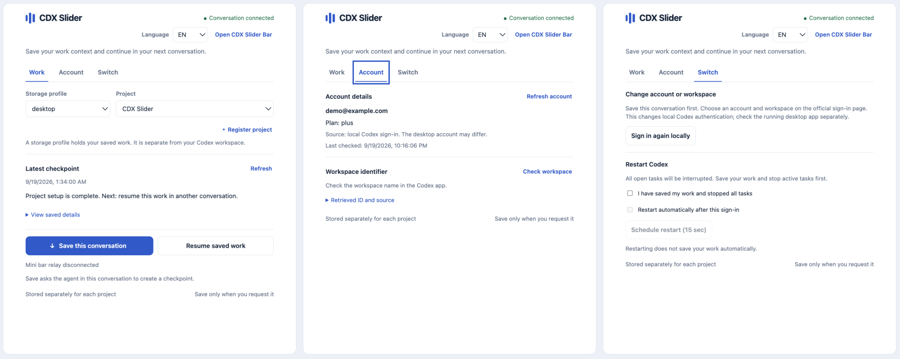

# CDX Slider

Codex에서 작업 맥락을 저장하고, 계정을 바꾼 뒤에도 새 대화에서 이어서 작업하세요. 프로젝트 메모와 체크포인트는 내 컴퓨터에 보관됩니다.

[English](README.md) · 기본 언어는 EN이며, 언어 선택에서 KR로 바꿀 수 있습니다.


*샘플 데이터로 촬영한 패널입니다. 화면 표시는 MCP Apps를 지원하는 호스트가 필요합니다.*

## 시작하기

[설치 안내](docs/assets/Installation.ko.md)에서 요구 사항 확인부터 저장소 복제, 빌드, Codex 플러그인 등록·활성화까지 순서대로 진행하세요. 설치 제거 방법도 같은 페이지에 있습니다.

Codex의 새 작업에서 다음을 실행하세요.

```text
$cdx-slider:slider-continuity
```

프로젝트를 등록하고, 대화를 떠나기 전에 **현재 대화 저장**, 다음 대화에서 **마지막 작업 불러오기**를 선택하세요. 저장은 에이전트의 완료 응답까지 확인하세요.

저장된 맥락을 참고해 작업을 이어가며, 원래 대화 전체를 복원하지는 않습니다. 선택 기능인 macOS 미니바의 불러오기 중계는 실험 단계입니다.

[기능 상세](docs/assets/Function.Details.ko.md) · [변경 기록](docs/assets/ChangeLog.ko.md) · [문서 목록](docs/README.md)

[MIT](LICENSE) · Copyright (c) 2026 hwonheo.
